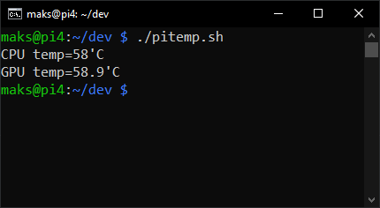

# pitemp

Pitemp is a simple bash script that displays the temperature of your Raspberry Pi's CPU and GPU.
It is a modified version of [this script](https://www.cyberciti.biz/faq/linux-find-out-raspberry-pi-gpu-and-arm-cpu-temperature-command/), which I uploaded to Github so that I have easy access to it.

### Installation

1. Clone the repository (or just download `pitemp.sh`)
2. Make sure the file is executable - if it's not, run the following command:
`chown +x pitemp.sh`
3. Run the script:
`./pitemp.sh`
4. (optional) If you wish to use it like a Linux command, copy the file to the `/usr/bin/` directory:
`sudo cp pitemp.sh /usr/bin/pitemp`
